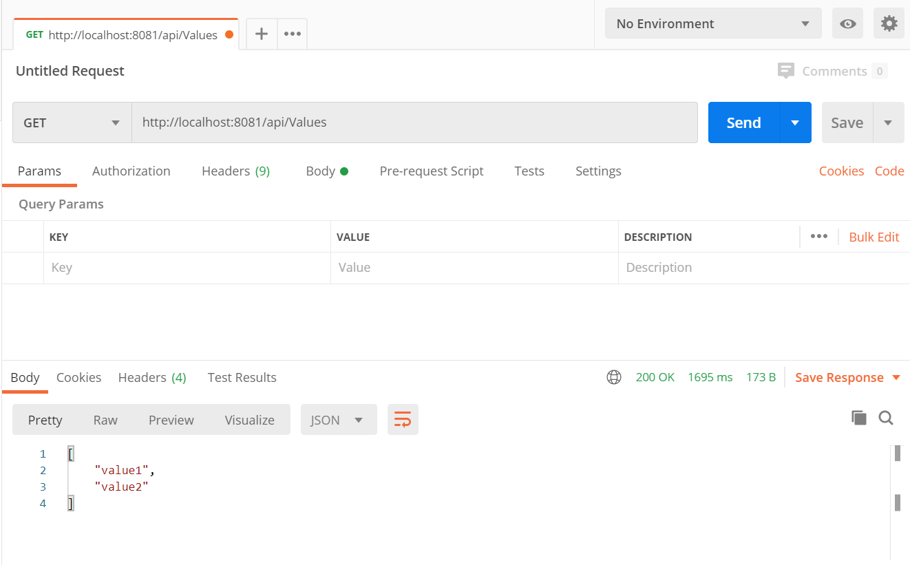

# Console Application Web Api

Console Application to host web api.

### Tech
* C#
* .NET Framework 4.7.2
* Console Application


### Install nuget
 Install nuget or build the solution file to install nuget package file

```sh
Install-Package Microsoft.Owin.Hosting -Version 4.1.0
Install-Package Microsoft.AspNet.WebApi.Core -Version 5.2.7
Install-Package Microsoft.AspNet.Cors 
Install-Package Microsoft.AspNet.WebApi.Cors
Install-Package Microsoft.AspNet.WebApi.OwinSelfHost
```

For production environments...
         var enviroment = Enviroment.PublicIp;
```sh
        private static string GetDomainName()
        {
            string domainName = string.Empty;
            var enviroment = Enviroment.Localhost;
            switch (enviroment)
            {
                case Enviroment.Localhost:
                    domainName = "http://localhost:8081/";
                    break;
                case Enviroment.PublicIp:
                    domainName = "http://*:80/";
                    break;
                default:
                    domainName = "http://*:8081/";
                    break;
            }
            return domainName;
        }
```
### Postman



